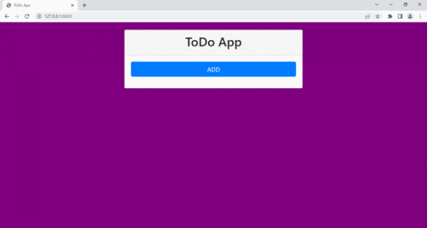

# Домашнее задание на тему Django Rest Framework

В Python проекте, используется фреймворк django для реализации приложения ToDo List.
Управление задачами реализовано с помощью rest api с использованием библиотеки django-rest-framework.

<p align="center">
    
</p>

## Функционал
* У каждой задачи есть дата и время создания, дата и время завершения. Время завершения задачи устанавливается в момент проставления галочки чек-бокс <input type="checkbox" checked> о завершении задачи.
* В каждой задаче есть статус выполнена она или нет (по-умолчанию не выполнена).
* Время завершения задачи убирается (становится null) в момент снятия галочки чек-бокса <input type="checkbox" unchecked> о завершении задачи.
* В браузере на главной странице отображается список всех незавершенных и выполненных задач.
* В браузере на главной странице присутствуют элементы управления задачами:
    * Кнопка <span style="color:DodgerBlue">**ADD**</span> - открывает форму на добавление новой задачи
    * [Заголовок задачи](http://127.0.0.1:8000/task/[id]) - открывает страницу с расширенным описанием
    * Кнопка <span style="color:teal">**EDIT**</span> - открывает форму для редактирования задачи, можно изменить статус и название задачи
    * Кнопка <span style="color:yellow">**CLOSE**</span> - отмечает задачу как выполненную <input type="checkbox" checked> и устанавливает дату и время завершения задачи
    * Кнопка <span style="color:red">**DELETE**</span> - удаляет задачу из БД
* Через админ панель можно создавать, изменять и удалять задачи, а также доступен  поиск по названию задачи.

## Rest API
Доступные методы для управления задачами:
* GET /api/tasks - получть список всех задач
* GET /api/tasks/{id} - получть одну конкретную задачу
* POST /api/tasks/ - создать задачу
* PUT (или PATCH) /api/tasks/{id}/ - отредактировать существующую задачу
* DELETE /api/tasks/{id} - удалить одну задачу

В GET запросах доступна: 
* фильтрация путем добавления query-параметров
    * ?title=... - поиск по заголовку задачи
    * ?is_active=... - поиск по статусу(true/false) задачи
* пагинация ?page=...
* сортировка ?ordering=...


## Как установить
```sh
$ git clone https://github.com/polipych/hw_22.git
$ cd .\hw_22\
$ pip install -r requirements.txt
```

## Как запустить
```sh
$ cd .\todolist\
$ py .\manage.py makemigrations
$ py .\manage.py migrate
$ py .\manage.py runserver
```
Открыть в веб-браузере страницу с адресом: http://127.0.0.1:8000/

## Доступ в Admin панель
Админ панель доступна по адресу: http://127.0.0.1:8000/admin/. Для входа необходимо зарегистрировать пользователя:
```sh
$ py .\manage.py createsuperuser
```